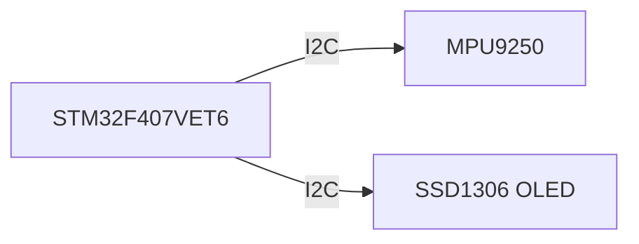
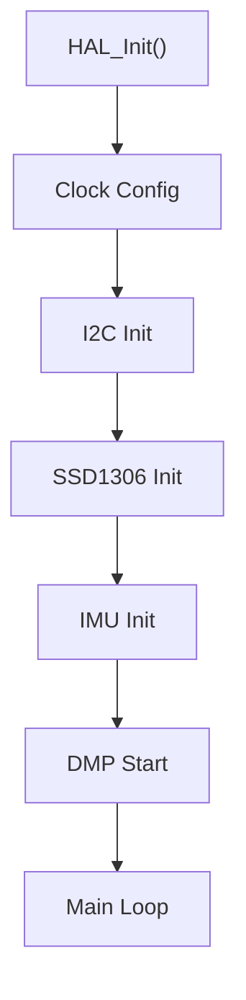
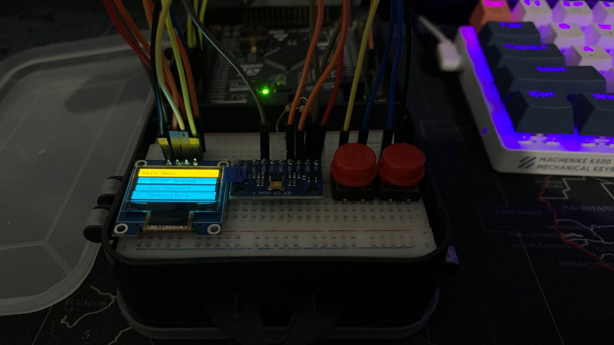
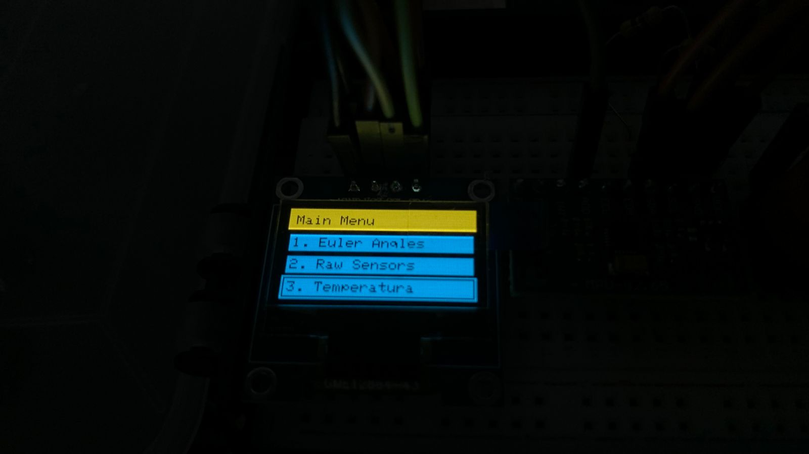
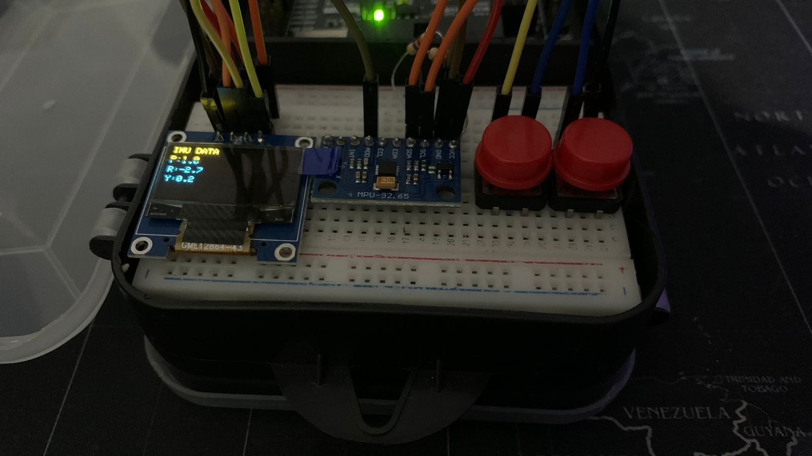
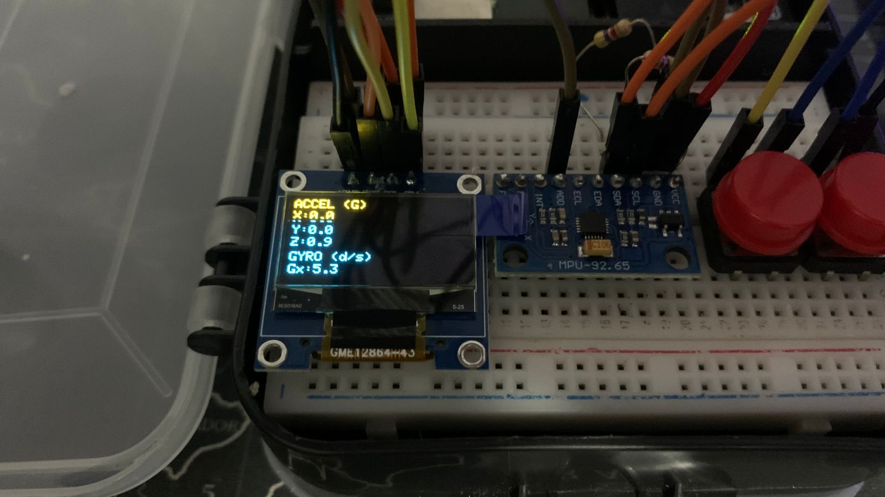
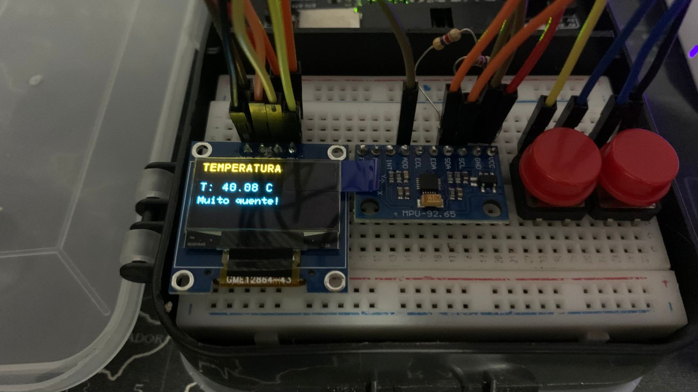

# Monitoramento de Orientação com MPU9250 e STM32F407

## Identificação

**Formação:** Sistemas Embarcados Virtus-CC
**Curso:** Curso 2 — Introdução aos Microcontroladores de 32 bits - Bare Metal
**Docente:** Prof. D.Sc. Rafael Bezerra Correia Lima
**Discente:** Vinicius Batista Duarte
**Periféricos Utilizados:** I2C, MPU9250, SSD1306 OLED, STM32F407VET6
**Versão:** 1.0 — 28 de Maio de 2026

---

# Resumo

Este projeto implementa um sistema de monitoramento de orientação espacial utilizando o microcontrolador STM32F407VET6, o sensor inercial MPU9250 e um display OLED SSD1306.

O sistema realiza a leitura de aceleração, velocidade angular e quaternions gerados pelo DMP (Digital Motion Processor) do MPU9250, convertendo os dados em ângulos de Euler (Roll, Pitch e Yaw) exibidos em tempo real no display.

Além da visualização da orientação, o projeto também apresenta:

* leitura dos sensores calibrados;
* conversão para unidades físicas;
* exibição da temperatura interna do sensor;
* navegação em menu utilizando interface OLED.

A comunicação entre os dispositivos é realizada via barramento I2C em 400 kHz, utilizando bibliotecas HAL do STM32.

---

# 1. Motivação

Sensores inerciais são amplamente utilizados em aplicações de robótica, estabilização, monitoramento de movimento e navegação.

O MPU9250 integra acelerômetro, giroscópio e magnetômetro em um único dispositivo, permitindo estimar orientação espacial através da fusão de sensores realizada pelo DMP interno do componente.

Este projeto tem como objetivo explorar:

* comunicação I2C em sistemas embarcados;
* leitura de sensores MEMS;
* processamento de orientação espacial;
* exibição gráfica em displays OLED;
* organização modular de software embarcado.

---

# 2. Arquitetura do Sistema

## 2.1 Componentes Utilizados

| Componente    | Função                          |
| ------------- | ------------------------------- |
| STM32F407VET6 | Processamento principal         |
| MPU9250       | Sensor inercial de 9 eixos      |
| SSD1306 OLED  | Interface de visualização       |
| AK8963        | Magnetômetro interno do MPU9250 |

---

## 2.2 Comunicação Entre Módulos

---

# 3. Funcionamento do Sistema

O MPU9250 realiza a aquisição dos dados do acelerômetro e giroscópio. O DMP interno executa o processamento de orientação e fornece quaternions atualizados periodicamente.

Os quaternions são convertidos em ângulos de Euler:

* Roll
* Pitch
* Yaw

Esses valores são exibidos no display OLED em tempo real.

O sistema também permite visualizar:

* aceleração nos três eixos;
* velocidade angular;
* temperatura interna do sensor.

---

# 4. Estrutura do Software

O software foi dividido em módulos independentes:

| Módulo      | Responsabilidade                   |
| ----------- | ---------------------------------- |
| `imu.c`     | Leitura e processamento do MPU9250 |
| `menu.c`    | Interface gráfica e navegação      |
| `main.c`    | Inicialização e laço principal     |
| `ssd1306.c` | Controle do display OLED           |

---

# 5. Interface do Usuário

O menu principal possui três opções:

1. Euler Angles
2. Raw Sensors
3. Temperature

## Euler Angles

Exibe:

* Pitch
* Roll
* Yaw

## Raw Sensors

Exibe:

* aceleração em G;
* velocidade angular em °/s.

## Temperature

Exibe a temperatura interna do MPU9250 em graus Celsius.

---

# 6. Fluxo de Inicialização

---

# 7. Resultados

O sistema conseguiu:

* realizar leitura estável do MPU9250;
* exibir orientação em tempo real;
* converter dados para unidades físicas;
* atualizar informações no display OLED de forma contínua.

Os ângulos apresentaram comportamento coerente com a movimentação física do sensor durante os testes realizados.

---

# 8. Imagens do Projeto

## Montagem Física

  

## Menu

  

## Leituras

  

  

  

---

# 9. Requisitos Atendidos

* [x] Comunicação I2C funcional
* [x] Leitura de aceleração e giroscópio
* [x] Conversão para unidades físicas
* [x] Cálculo de Roll, Pitch e Yaw
* [x] Interface OLED funcional
* [x] Estrutura modular em C
* [x] Exibição de temperatura

---

# 10. Conclusão

O projeto demonstrou a integração entre um microcontrolador STM32 e um sensor inercial MPU9250 utilizando comunicação I2C e processamento de orientação espacial.

A utilização do DMP simplificou a obtenção de quaternions e permitiu a exibição estável dos ângulos de Euler em tempo real.

Além da aplicação prática com sensores MEMS, o desenvolvimento também contribuiu para o aprendizado de:

* modularização de firmware;
* utilização da HAL STM32;
* manipulação de dados inerciais;
* interfaces embarcadas com displays OLED.
